# Debian Package Repository

APT repository for Daniel Nylander's localization and development tools.

## Quick Setup

```bash
curl -fsSL https://yeager.github.io/debian-repo/KEY.gpg | sudo gpg --dearmor -o /usr/share/keyrings/yeager-archive-keyring.gpg
echo "deb [signed-by=/usr/share/keyrings/yeager-archive-keyring.gpg] https://yeager.github.io/debian-repo stable main" | sudo tee /etc/apt/sources.list.d/yeager.list
sudo apt update
```

## Available Packages

### GUI Applications (GTK4/Adwaita)

| Package | Version | Description | Screenshot |
|---------|---------|-------------|------------|
| [cldr-viewer](https://github.com/yeager/cldr-viewer) | 0.1.2 | Browse and compare Unicode CLDR locale data | 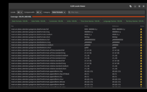 |
| [commonvoice-status](https://github.com/yeager/commonvoice-status) | 0.1.1 | Mozilla Common Voice recording statistics | 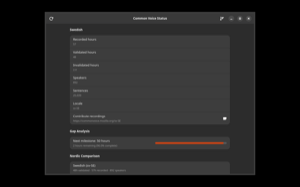 |
| [ddtp-translate](https://github.com/yeager/ddtp-translate) | 0.1.0 | Translate Debian package descriptions via DDTP | |
| [desktop-editor](https://github.com/yeager/desktop-editor) | 0.2.1 | Visual .desktop file editor with translation support | 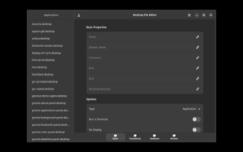 |
| [elementary-l10n](https://github.com/yeager/elementary-l10n) | 0.2.4 | elementary OS translation status via Weblate | 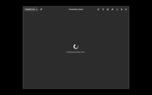 |
| [fedora-l10n](https://github.com/yeager/fedora-l10n) | 0.2.1 | Fedora translation progress via Weblate | 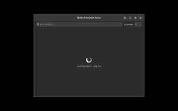 |
| [font-preview](https://github.com/yeager/font-preview) | 0.2.2 | Preview and compare installed fonts | 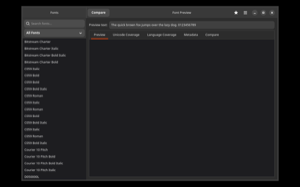 |
| [github-l10n](https://github.com/yeager/github-l10n) | 0.2.2 | Scan GitHub repos for missing translations | 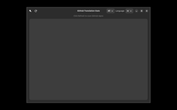 |
| [l10n-glossary](https://github.com/yeager/l10n-glossary) | 0.2.2 | Translation glossary editor (TBX/CSV/TSV) | |
| [l10n-lint-gtk](https://github.com/yeager/l10n-lint) | 1.2.9 | Translation file linter (GTK interface) | 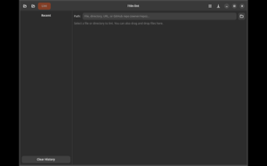 |
| [l10n-preview](https://github.com/yeager/l10n-preview) | 0.2.2 | Preview translations with quality indicators | 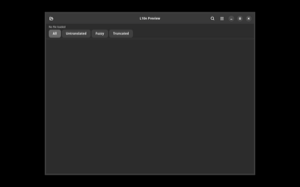 |
| [langpack-inspector](https://github.com/yeager/langpack-inspector) | 0.2.1 | Inspect Ubuntu language pack coverage | 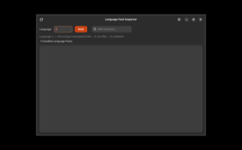 |
| [libretranslate-gui](https://github.com/yeager/libretranslate-gui) | 0.2.2 | Translation assistant via LibreTranslate | 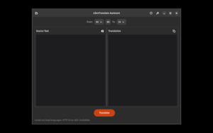 |
| [locale-tester](https://github.com/yeager/locale-tester) | 0.2.2 | Inspect and compare system locale settings | 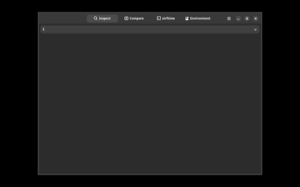 |
| [pcap-viewer](https://github.com/yeager/pcap-viewer) | 0.1.0 | Analyze pcap/pcapng network captures | |
| [snap-l10n](https://github.com/yeager/snap-l10n) | 0.2.1 | Translation status of installed Snap packages | 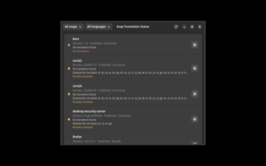 |
| [tm-manager](https://github.com/yeager/tm-manager) | 0.2.2 | TMX translation memory manager | 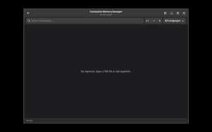 |
| [ubuntu-l10n](https://github.com/yeager/ubuntu-l10n) | 0.2.1 | Ubuntu translation statistics from Launchpad | 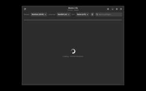 |

### CLI Tools

| Package | Version | Description |
|---------|---------|-------------|
| [l10n-lint](https://github.com/yeager/l10n-lint) | 1.15.0 | Translation file linter (CLI) |
| [l10n-conv](https://github.com/yeager/l10n-conv) | 1.0.1 | Universal l10n file converter |
| [po-translate](https://github.com/yeager/po-translate) | 1.5.0 | Machine-translate PO files |
| [po-diff](https://github.com/yeager/po-diff) | 1.0.0 | Diff two PO files |
| [tp-lint](https://github.com/yeager/tp-lint) | 1.8.1 | Translation project linter |
| [svlang](https://github.com/yeager/svlang) | 0.1.1 | Swedish language tools |
| [linguaedit](https://github.com/yeager/linguaedit) | 1.8.14 | Translation editor |
| [makebread](https://github.com/yeager/makebread) | 0.3.0 | Build tool for translation projects |

## GPG Key

All packages are signed with key `DAB053A8`.

## License

All tools are GPL-3.0-or-later by Daniel Nylander <daniel@danielnylander.se>.
